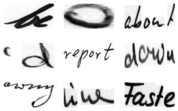
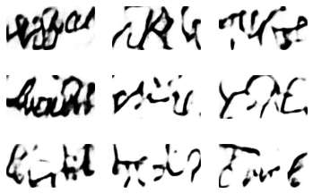
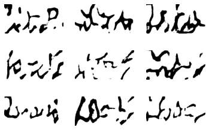
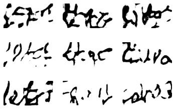

# nn-image-generation
This assignment was completed as part of my master's in AI at NUIG. 
The project uses neural networks to generate image data. 
More specifcally, Images of handwriting are generated using an Autoecnoder, a Variational Autoencoder and a Generative Adversarial Network.  
Images from dataset 
 
Images generated by autoencoder 
 
Images generated by variational autoencoder 
 
Images generatedby GAN 
 

